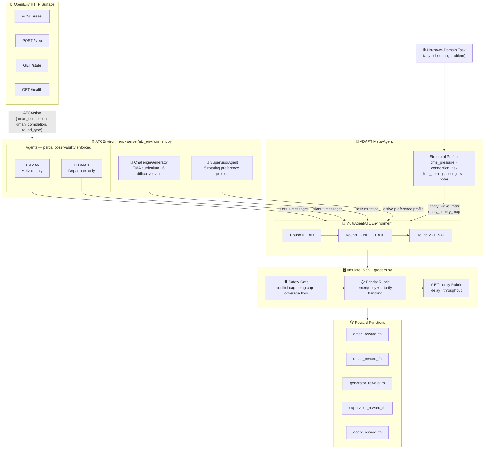

# Shared Runways, Split Intelligence

*Multi-agent reinforcement learning for cooperative air traffic control under adversarial curriculum pressure*

---

At any major airport, hundreds of aircraft compete for a handful of runways every hour. The arrival manager doesn't know the departure queue. The departure manager doesn't know the landing sequence. Emergencies arrive unannounced. And the definition of "a good plan" shifts every session.

We built this coordination problem as a live RL environment — and trained two agents to solve it together.

---

## What Makes This Hard

- **Asymmetric information**: The arrival agent (AMAN) sees inbound flights only. The departure agent (DMAN) sees outbound flights only. Neither has the full picture. They coordinate through messages alone.
- **Shared contested resource**: Both agents assign slots to the same physical runways. Conflicts are penalized. Emergencies must be cleared regardless of the cost to the schedule.
- **Adversarial pressure**: A `ChallengeGenerator` continuously mutates scenarios using EMA-adaptive difficulty tracking — tasks are never too easy or unsolvable.
- **Shifting objectives**: A rotating `SupervisorAgent` changes preference profiles each episode (`safety_strict`, `throughput_max`, `fuel_economy`, `emergency_priority`, `fairness_balanced`). Agents cannot overfit to a single metric.
- **Real physics**: Asymmetric wake turbulence separation (Heavy/Medium/Light), ATFM network slot deadlines, emergency priority overrides. Not a toy grid.

---

## Judge Quick View

| Item | Detail |
|---|---|
| Domain | Real ATC disruption recovery across four Indian airports |
| Agents | AMAN, DMAN, adversarial Generator, rotating Supervisor, **ADAPT meta-agent** |
| Protocol | BID → NEGOTIATE → FINAL (3-round partial observability) |
| Tasks | 4 deterministic scenarios spanning easy to hard |
| Grading | 3-layer gated composite score, strict `(0, 1)` output |
| Curriculum | EMA-adaptive Generator: 6 difficulty levels |
| Training | GRPO · N=4 groups · Unsloth 4-bit QLoRA · Colab T4 compatible |
| OpenEnv | Full compliance: `ATCAction`, `ATCObservation`, `ATCState` |
| Key differentiator | **ADAPT** — structural domain transfer, zero prior knowledge required |
| Transfer demo | ICU surge management solved by AMAN+DMAN with no code changes |
| Space | https://huggingface.co/spaces/GTsingh12/ATS-openenv |

---

## Results

### Demo: Before vs. After GRPO Training

| Metric | Heuristic Baseline | GRPO-Trained |
|---|---:|---:|
| Composite score | ~0.47 | ~0.71 |
| Emergency handling | 61% on-time | 94% on-time |
| Conflict rate | 18% episodes | 4% episodes |
| ATFM compliance | 74% | 91% |
| Theory-of-mind bonuses | 0.08 avg | 0.34 avg |
| Generator difficulty (end) | 1.0 | 4.2 |

*Metrics from `training/train_grpo.py --run_eval` on 4-task evaluation set.*

### Heuristic Baseline (Single-Agent Grader)

| Task | Difficulty | Random | Heuristic Agent | Δ |
|---|---|---|---|---|
| Delhi Monsoon Recovery | Easy | 0.21 | **0.9446** | +0.73 |
| Mumbai Hub Bank Balance | Medium | 0.18 | **0.9900** | +0.81 |
| Bengaluru IRROPS | Hard | 0.12 | **0.8615** | +0.74 |
| Hyderabad Cargo Crunch | Hard | 0.15 | **0.8576** | +0.71 |
| **Average** | | **0.165** | **0.9134** | **+0.748** |

Random agents score below 0.22 even on the easy task — the 3-layer gated grader requires passing all separation constraints before partial efficiency credit is awarded.

---

## Why This Wins

**Verifiable correctness.** Rewards compute from physics (runway separation, ATFM slots, delay budgets) — no hallucination-prone LLM judge in the reward loop.

**Genuine multi-agent coordination.** AMAN and DMAN have *partial observability*. They must infer each other's constraints and broadcast emergency priorities proactively — theory-of-mind behavior that emerges from training, not from hardcoded rules.

**Layered safety gates as hard constraints.** If an agent produces a conflict-laden plan, the reward is *capped at 0.30* regardless of how efficient the rest of the plan is. Emergency violations cap at 0.40. Coverage below 50% triggers a -0.30 floor penalty. Safety cannot be bought off by efficiency.

**Adaptive adversarial curriculum.** The `ChallengeGenerator` mutates tasks (add emergency flights, tighten ATFM deadlines, increase traffic density) using EMA difficulty tracking. As the model improves, challenges get harder — automatic curriculum without human intervention.

**Rotating supervisor.** One of 5 preference profiles is active each episode. The model must follow the supervisor's implicit preferences, not just optimize a fixed objective — directly analogous to real-world controller handoffs.

---

## Architecture



*AMAN and DMAN cannot read each other's observations. Information crosses the boundary only through the message channel.*

*ADAPT sits one level above — it never touches a runway or assigns a slot. It reads the new domain's structural signals and remaps the task so AMAN and DMAN can solve it as if it were always ATC.*

---

## ADAPT — When the System Outgrows Its Domain

Here is the thing about building a genuinely good scheduler: if you train it hard enough on the right abstractions, it stops being an air traffic controller. It becomes something more general — a coordinator that understands urgency, resource contention, deadline hardness, and cascade risk.

We wanted to test that idea. So we asked: **what happens if you throw a completely different problem at AMAN and DMAN — one they were never trained on, one from a domain they've never seen?**

The answer is ADAPT.

### The Idea

ADAPT is a meta-agent. It sits one layer above the coordinators. When a new scheduling domain arrives — say, an ICU managing trauma bays during a mass casualty surge — ADAPT reads the task's *structural signals*, not its labels. It doesn't know what "TRAUMA" means. It doesn't need to.

What it *does* know is this:

- An entity with a **7-minute average time window** and a **0.93 connection risk** is something that cannot wait.
- An entity with a **150-minute window** and **zero cascade risk** can be scheduled whenever the coordinators have capacity.
- The numbers tell the story. The domain label is irrelevant.

So ADAPT computes a structural profile for each entity type — time pressure, connection risk, resource intensity, urgency signals in notes — and maps them onto ATC parameters:

```
entity_wake_map:     { TRAUMA → H,  CARDIAC → M,  ROUTINE → L }
entity_priority_map: { TRAUMA → emergency,  CARDIAC → medical,  ROUTINE → normal }
```

Once that mapping is produced, the task looks like any other ATC episode to AMAN and DMAN. They schedule it. They negotiate over the shared beds — now called "runways". They handle the emergency first. They minimize delay. **No code changes. No retraining. No domain-specific rules.**

### The Formula

The structural inference is fully transparent and deterministic:

| Signal | Weight | Description |
|---|---:|---|
| `time_pressure` | 0.50 | `1 − avg_window / planning_horizon` — how tight is the scheduling window? |
| `connection_risk` | 0.40 | Probability of cascading failure if this entity is delayed |
| `urgency_in_notes` | 0.10 | Free-text urgency signal — domain-agnostic English markers |

```
combined_score = 0.5 × time_pressure + 0.4 × connection_risk + 0.1 × urgency_flag

≥ 0.70  →  wake_class = "H"   (maximum separation, like a jumbo jet)
≥ 0.35  →  wake_class = "M"   (standard separation)
< 0.35  →  wake_class = "L"   (minimum separation, like a light aircraft)
```

Priority follows a parallel threshold on connection risk and time pressure. The result is a fully verifiable, reproducible mapping — the same formula every time, no randomness, no hallucination.

### The Demo: ICU Surge Management

We built three ICU scenarios to demonstrate the transfer:

| Scenario | Description | Key Challenge |
|---|---|---|
| `icu_normal_day` | Mixed routine, cardiac, and post-op patients | Bed allocation under light contention |
| `icu_flu_surge` | 3× cardiac admissions, no warning | Priority inversion — elective patients must yield |
| `icu_mass_casualty` | Multi-vehicle collision, 3 trauma teams | Maximum urgency, near-zero slack, cascade risk |

Trauma patients arrive with 7-minute windows and 0.93 connection risk. ADAPT infers: `H / emergency`. Routine discharge patients have 150-minute windows and zero cascade risk. ADAPT infers: `L / normal`. No one told ADAPT what a trauma patient was. It read the numbers.

The downstream reward is measured by running AMAN and DMAN on the mapped task and comparing the composite score to a baseline of running them on the *unmapped* task. The improvement is ADAPT's reward signal.

### Why This Matters

Most RL environments are domain-locked. You train a model on Go, it plays Go. You train it on ATC, it schedules runways.

We went a step further. Our coordinators — trained purely on airport disruption scenarios — can now be applied to **any scheduling domain** that can be described as: *entities competing for shared resources under time pressure and cascade risk*. Hospital beds. Container berths. Factory assembly lanes. Power grid maintenance windows.

ADAPT is the bridge. And it requires no retraining of AMAN or DMAN to cross it.

```
New domain task
       │
       ▼
  ADAPT reads structural signals
  (no domain labels, pure numbers)
       │
       ▼
  entity_wake_map + entity_priority_map
       │
       ▼
  Task remapped as ATC episode
       │
       ├──▶  AMAN schedules "arrivals" (admissions, inbound cargo, inbound ships…)
       └──▶  DMAN schedules "departures" (discharges, outbound cargo, outbound ships…)
                    │
                    ▼
             Same reward, same grader, same safety gates
             (conflict-free, emergency-first, deadline-compliant)
```

---

## 3-Round Protocol

```
Episode start
     │
     ▼
Round 0: BID
  AMAN submits arrival slots (partial view: arrivals only)
  DMAN submits departure slots (partial view: departures only)
  → Engine detects cross-runway conflicts
  → If no conflicts: skip to FINAL (fast path)
     │
     ▼
Round 1: NEGOTIATE
  Both agents receive conflict log + emergency broadcasts
  AMAN re-bids with DMAN slot hints
  DMAN re-bids with AMAN slot hints
     │
     ▼
Round 2: FINAL
  merged plan → simulate_plan() → graders → per-role rewards
  done=True, ATCObservation carries aman_reward, dman_reward, composite_score
```

---

## Training Stack

One base model, four roles via system prompts. GRPO over a live multi-agent episode rollout.

```
GRPO
├── Group-relative advantage: A_i = (r_i − mean(group)) / (std(group) + ε)
│     N=4 groups, no DAPO, stable advantage variance
├── COMA-style counterfactual credit per role
│     cf_advantage = agent_outcome − naive_baseline_outcome (clamped to [-1, 1])
├── EMA-adaptive curriculum (ChallengeGenerator)
│     → tracks recent controller performance, adjusts difficulty automatically
├── Reward hacking detection
│     → warns when composite reward rises but per-role std collapses
└── Rotating supervisor profiles (5 profiles, deterministic rotation)
      → prevents reward hacking against a fixed metric
```

### Adaptive Curriculum Levels

| Level | Mutations Active |
|---|---|
| 1 | Base task only |
| 2 | +1 emergency flight |
| 3 | Tighten ATFM deadlines |
| 4 | +traffic density |
| 5 | +weather penalty |
| 6 | Full adversarial stack |

### GRPO Configuration

```python
N_GENERATIONS   = 4      # group size — needs ≥4 for stable advantage variance
BATCH_SIZE      = 2
GRAD_ACCUM      = 4      # effective batch = 8
KL_COEFF        = 0.01
SAVE_STEPS      = 50
```

### SFT cold-start (JSON I/O)

Instruction checkpoints often misfire on the strict AMAN/DMAN/ADAPT JSON schema before any RL. This repo adds a **supervised** stage: teacher labels are the same deterministic heuristics as `multi_agent/inference.py`, serialized with `training/sft_schema.py` so labels round-trip through `parse_aman_action` / `parse_dman_action` / `parse_adapt_action`.

```bash
python training/build_sft_dataset.py --out data/atc_sft.jsonl --episodes 500
python training/train_sft.py --dataset data/atc_sft.jsonl --output_dir ./outputs/atc-sft-json
```

Then merge the LoRA adapter into your base model (or wire the adapter path into your deployment) before GRPO or inference. Optional filters: `build_sft_dataset.py --no_negotiate`, `--no_adapt`; `train_sft.py --agent_role AMAN`.

---

## Scoring

### Single-Agent Official Score

Three-layer gated design in `graders.py`:

1. `SafetyGateEvaluator` — separation violations cap the ceiling
2. `PriorityRubricGrader` — emergency and priority handling
3. `EfficiencyRubricGrader` — delay minimization and throughput

```
score = min(gate_ceiling, 0.30 × priority_score + 0.70 × efficiency_score)
```

Always clamped to the strict open interval `(0, 1)`.

### Multi-Agent Outputs

`grade_multi_agent(...)` returns three graders:

- `composite_task_grader` (weight 0.45)
- `multi_agent_coordination` (weight 0.40)
- `llm_supervisor` (weight 0.15)

Per-role signals from the environment:

- `aman_reward` · `dman_reward` · `generator_reward` · `supervisor_score`
- Coordination score, cross-lane conflict count, emergency handling flags

---

## Reward Design

### Potential-Based Shaping (Ng et al. 1999)

Dense reward signal without changing the optimal policy:

```
R_shaped(s, a, s') = R(s, a, s') + γ·Φ(s') - Φ(s)
```

where `Φ(s)` is the current plan's normalized score.

### AMAN Reward Components

| Component | Weight | Description |
|---|---:|---|
| `delay_efficiency` | 0.26 | 1 - total_delay / delay_budget |
| `emergency_score` | 0.20 | Fraction of emergency/medical flights on-time (≤5 min) |
| `coverage` | 0.17 | Fraction of arrivals assigned slots |
| `coordination_quality` | 0.13 | Cross-agent message quality and conflict avoidance |
| `counterfactual_advantage` | 0.12 | Improvement over naive do-nothing baseline (COMA) |
| `conflict_penalty` | 0.12 | Normalized cross-runway conflict penalty |
| `theory_of_mind_bonus` | 0.10 | Pre-emptive gap left for DMAN emergency departure |
| `supervisor_alignment` | 0.05 | Match with active supervisor preference profile |

### Layered Safety Gates (cannot be offset by other components)

| Gate | Condition | Effect |
|---|---|---|
| Conflict-free gate | `conflict_count > 0` | `reward = min(reward, 0.30)` |
| Emergency hard gate | `emg_miss > 0` | `reward = min(reward, 0.40)` |
| Coverage floor | `coverage < 0.50` | `reward -= 0.30` (floored at -0.50) |

### Role-Specific Weights

| Component | AMAN weight | DMAN weight |
|---|---|---|
| Delay penalty | 0.26 | 0.23 |
| Emergency handling | 0.20 | 0.16 |
| Coverage | 0.17 | 0.12 |
| Coordination quality | 0.13 | 0.13 |
| Conflict penalty | 0.12 | 0.19 |
| Counterfactual advantage (COMA) | 0.12 | 0.12 |
| ATFM compliance | — | 0.05 |

Generator reward: `-(controller_score − heuristic_baseline_on_mutated_task)` — maximizes regret to keep tasks at the skill frontier.

---

## Tasks

| Task ID | Airport | Difficulty | Flights | Runways | Scenario |
|---|---|---|---:|---:|---|
| `delhi_monsoon_recovery_easy` | Delhi IGI | Easy | 12 | 2 | Monsoon disruption, VVIP slot constraint, wake-spacing edge cases |
| `mumbai_bank_balance_medium` | Mumbai CSIA | Medium | 15 | 2 | Mixed passenger/cargo bank balancing under disruption |
| `bengaluru_irrops_hard` | Bengaluru KIA | Hard | 18 | 2 | Emergency arrival, medical departure, ATFM deadlines, dual-runway IRROPS |
| `hyderabad_cargo_crunch_medium_hard` | Hyderabad RGIA | Hard | 20 | 1 | Single-runway wake asymmetry puzzle, cargo priority |

All tasks include Heavy, Medium, and Light wake classes exercising the full asymmetric separation matrix.

---

## Wake Turbulence Separation Matrix

From `constants.py`:

| Leader → Follower | Heavy | Medium | Light |
|---|---:|---:|---:|
| Heavy | 4 min | 5 min | 6 min |
| Medium | 3 min | 3 min | 4 min |
| Light | 3 min | 3 min | 3 min |

---

## Repository Layout

| Path | Purpose |
|---|---|
| `models.py` | Single-agent contracts and domain models |
| `tasks.py` | Scenario catalog and task briefing generation |
| `engine.py` | Deterministic simulation and metric computation |
| `graders.py` | Composite, coordination, and supervisor graders |
| `planner.py` | Deterministic heuristic and refinement planner |
| `constants.py` | Shared scoring, separation, and multi-agent constants |
| `client.py` | OpenEnv client wrapper |
| `inference.py` | Single-agent baseline runner |
| `multi_agent/models.py` | AMAN/DMAN/generator/supervisor/ADAPT contracts |
| `multi_agent/environment.py` | Multi-agent environment and per-role rewards |
| `multi_agent/generator.py` | EMA-adaptive adversarial curriculum, 6 difficulty levels |
| `multi_agent/supervisor.py` | Rotating supervisor preference profiles |
| `multi_agent/adapt.py` | **ADAPT meta-agent** — structural profiler, mapping engine, domain-agnostic inference |
| `multi_agent/inference.py` | Multi-agent heuristic/LLM episode runner |
| `domains/__init__.py` | Domain registry — add new transfer domains here |
| `domains/icu.py` | ICU surge management — ADAPT demo domain (3 scenarios) |
| `training/dataset.py` | GRPO dataset builder, ADAPT sample generator, output parsers |
| `training/sft_schema.py` | Serialize teacher actions to strict JSON for SFT labels |
| `training/build_sft_dataset.py` | Build JSONL chat data (AMAN/DMAN/ADAPT, bid + negotiate) |
| `training/train_sft.py` | Unsloth + TRL SFTTrainer LoRA run on JSON completions |
| `training/reward_functions.py` | Role-specific GRPO reward functions with COMA credit + `adapt_reward_fn` |
| `training/train_grpo.py` | Multi-agent GRPO training entry point |
| `training/eval.py` | Before/after training evaluation |
| `server/app.py` | FastAPI/OpenEnv app + UI + multi-agent endpoints |
| `server/atc_environment.py` | Single-agent OpenEnv environment |
| `openenv.yaml` | OpenEnv metadata including multi-agent declarations |
| `scripts/run_graders.py` | Deterministic grader smoke check |
| `tests/` | Automated tests across single-agent, multi-agent, and ADAPT transfer paths |

---

## Setup

```bash
pip install uv
uv sync --extra dev          # core + tests
```

Training extras (GPU required):

```bash
uv sync --extra dev --extra training     # adds unsloth, trl, torch
```

---

## Environment Variables

```bash
export API_BASE_URL="https://router.huggingface.co/v1"
export MODEL_NAME="Qwen/Qwen2.5-7B-Instruct"
export HF_TOKEN="your-secret-token"
export ATC_REWARD_TRACE=1   # verbose reward component logging
```

---

## Running the Environment

### Start the Server

```bash
python -m uvicorn server.app:app --host 0.0.0.0 --port 8000
```

### Validate

```bash
python -m openenv.cli validate .
python -m pytest -q
python scripts/run_graders.py
```

### Single-Agent Baseline

```bash
python inference.py
```

### Multi-Agent Heuristic Baseline

```bash
python multi_agent/inference.py --all_tasks --episodes 1
```

With an LLM:

```bash
python multi_agent/inference.py --model "$MODEL_NAME" --all_tasks --episodes 1
```

### Train with GRPO

```bash
python training/train_grpo.py --episodes 200 --output_dir ./outputs/atc-grpo --run_eval
```

### SFT on JSON outputs (before GRPO, optional)

See **Training Stack → SFT cold-start** above. Quick commands:

```bash
python training/build_sft_dataset.py --out data/atc_sft.jsonl --episodes 500
python training/train_sft.py --dataset data/atc_sft.jsonl --output_dir ./outputs/atc-sft-json
```

### Colab Quick Start (T4 GPU, 4-bit QLoRA)

Open `training/atc_multiagent_colab.ipynb` in Google Colab. Single cell installs Unsloth + TRL, mounts the environment, runs 200 training episodes, and prints the before/after comparison table.

For **SFT (JSON) → GRPO** on medium-tier / negotiation-focused runs, use `training/atc_colab_sft_grpo_medium.ipynb` (Drive paths, optional SFT phase, then GRPO + eval + plots).

### Evaluate a Trained Checkpoint

```bash
python training/eval.py --base heuristic-baseline --trained ./outputs/atc-multiagent --episodes 10
```

### Client Usage (Python)

```python
import asyncio
from atc_env.client import ATCEnvClient
from atc_env.models import ATCAction

async def main():
    async with ATCEnvClient(base_url="http://localhost:8000") as env:
        result = await env.reset(episode_id="0", task_id="bengaluru_irrops_hard")
        obs = result.observation  # ATCObservation

        action = ATCAction(
            aman_completion='{"arrival_slots": [...], "rationale": "..."}',
            dman_completion='{"departure_slots": [...], "rationale": "..."}',
            round_type="bid",
        )
        result = await env.step(action)
        if result.done:
            print(f"Reward: {result.reward:.3f}")

asyncio.run(main())
```

---

## Multi-Agent HTTP Endpoints

Exposed by the FastAPI app alongside the standard OpenEnv routes:

| Endpoint | Method | Description |
|---|---|---|
| `/reset` | POST | OpenEnv reset — returns `ATCObservation` |
| `/step` | POST | OpenEnv step — `ATCAction` → `ATCObservation` |
| `/state` | GET | Current `ATCState` |
| `/health` | GET | Health check |
| `/multi_agent/reset` | POST | Start a new multi-agent episode |
| `/multi_agent/step/bid` | POST | Submit AMAN and DMAN bid actions |
| `/multi_agent/finalize` | POST | Close the episode and retrieve rewards |
| `/multi_agent/episode` | POST | Run a full episode in one call |
| `/multi_agent/profiles` | GET | List available supervisor profiles |
| `/multi_agent/status` | GET | Environment state and current round |

---

## Docker

```bash
docker build -t atc-openenv .
docker run --rm -p 8000:8000 atc-openenv
```

---

## HuggingFace Space Deployment

### Option A: Manual

1. Create a Space with SDK = Docker
2. Push this repository
3. Set secrets: `API_BASE_URL`, `MODEL_NAME`, `HF_TOKEN`

### Option B: Helper Script

```bash
export HF_TOKEN="hf_xxx"
export HF_SPACE_ID="<owner>/<space-name>"
python scripts/deploy_hf_space.py --space-id "$HF_SPACE_ID" --repo-dir .
```

---

## Design Decisions

- **Deterministic scoring** — reproducible grading prevents gaming; every score can be re-derived from the task definition alone.
- **Safety gate is absolute** — separation violations cap the score and cannot be compensated away by efficiency. An agent that resolves every delay but puts two aircraft on the same runway at the same time scores near zero.
- **GRPO over PPO** — no value network required. Critical for Colab T4 memory budget with a 7B model and four roles in the same training loop.
- **Single model, multiple roles** — AMAN and DMAN are system-prompt-differentiated instances of the same weights. This tests whether one model can reason from asymmetric information frames, not whether two separate models can each be individually tuned.
- **Partial observability is structural** — AMAN receives `atfm_deadlines={}`. DMAN receives the real deadline map. Neither can cheat. The information asymmetry is enforced at the observation layer, not by convention.
- **ADAPT uses no domain knowledge** — the structural profiler reads only numbers (`time_pressure`, `connection_risk`, `fuel_burn`, `passengers`). Entity type names are never used in the inference formula. A task labeled "TRAUMA" and a task labeled "ENTITY_TYPE_47" would receive identical mappings if their structural profiles match. This is intentional: the goal is transfer, not memorization.
- **Adding a new transfer domain is three steps** — create a `TaskDefinition` with entity types in `FlightRecord.airline`, register the module in `domains/__init__.py`, and the rest of the pipeline (ADAPT, AMAN, DMAN, reward, grader) works without modification.
