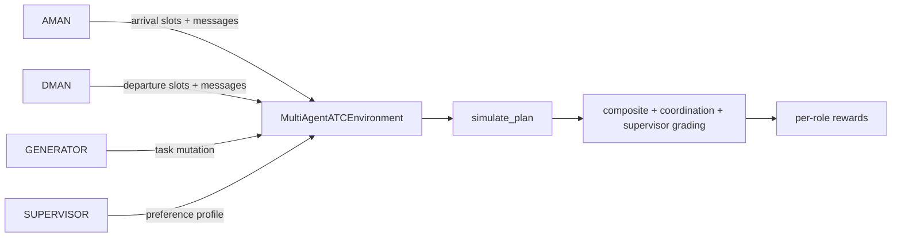

# ATC Optimization OpenEnv

A real-world OpenEnv benchmark for air traffic disruption recovery.

The repository now ships two complementary modes:

- A validated single-agent OpenEnv benchmark with deterministic grading, dense rewards, and a strong heuristic baseline in `inference.py`
- A multi-agent AMAN/DMAN coordination stack with adversarial task mutation, rotating supervisor preferences, and GRPO training utilities under `multi_agent/` and `training/`

The single-agent path is the current submission-ready baseline. The multi-agent path is the coordination/research/training track and is also exposed through the FastAPI app.

## Judge Quick View

| Item | Detail |
|---|---|
| Domain | Real ATC disruption recovery, not a game |
| Modes | Single-agent OpenEnv + multi-agent AMAN/DMAN coordination |
| Tasks | 4 deterministic tasks spanning easy to hard |
| Grading | 3-layer gated composite score with strict `(0, 1)` outputs |
| Multi-agent extras | Generator curriculum, supervisor profiles, coordination grading |
| Baselines | Root `inference.py` and `multi_agent/inference.py` |
| Training | GRPO dataset builder, reward functions, train/eval scripts |
| Validation | `pytest -q`, `scripts/run_graders.py`, OpenEnv validation, local checklist |
| Space | https://huggingface.co/spaces/GTsingh12/ATS-openenv |

## What Is In This Repo

### Single-Agent Benchmark

The classic OpenEnv mode asks one agent to submit a full runway-slot plan for a task. The environment returns diagnostics, dense reward shaping, and deterministic grader output.

Core path:

- `server/atc_environment.py`
- `engine.py`
- `graders.py`
- `planner.py`
- `inference.py`

### Multi-Agent Coordination Stack

The multi-agent mode splits control into:

- `AMAN`: Arrival Manager
- `DMAN`: Departure Manager
- `GENERATOR`: adversarial self-play scenario mutator
- `SUPERVISOR`: rotating preference profile that changes what "good" means episode to episode

Protocol:

1. `BID`: AMAN and DMAN propose independently
2. `NEGOTIATE`: conflicts and emergency broadcasts are exchanged
3. `FINAL`: merged plan is graded and per-role rewards are computed

Important runtime behavior:

- `multi_agent/inference.py` uses mutated tasks by default
- pass `--no_generator` to run on the original base task without mutations
- the environment uses the mutated task for the episode whenever one is supplied

## Architecture

### Single-Agent

```mermaid
graph LR
    A[Single Agent] -->|ATCOptimizationAction| B[OpenEnv step API]
    B --> C[ATCOptimizationEnvironment]
    C --> D[Simulation Engine]
    D --> E[Gated Graders]
    E --> F[Observation + Reward]
    C --> G[/state]
```

### Multi-Agent



## Tasks

Defined in `tasks.py`.

| Task ID | Title | Difficulty | Flights | Runways | Notes |
|---|---|---|---:|---:|---|
| `delhi_monsoon_recovery_easy` | Delhi Monsoon Departure Recovery | Easy | 10 | 2 | Includes light aircraft wake-spacing edge cases |
| `mumbai_bank_balance_medium` | Mumbai Hub Bank Balance | Medium | 14 | 2 | Mixed passenger/cargo bank balancing under disruption |
| `bengaluru_irrops_hard` | Bengaluru IRROPS Recovery Command | Hard | 18 | 2 | Emergency arrival, medical departure, ATFM deadlines |
| `hyderabad_cargo_crunch_medium_hard` | Hyderabad Single-Runway Cargo Crunch | Hard | 7 | 1 | Single-runway wake asymmetry puzzle |

All four tasks include Heavy, Medium, and Light wake classes to exercise the full asymmetric separation matrix.

## Scoring

### Single-Agent Official Score

`graders.py` implements a 3-layer gated design:

1. `SafetyGateEvaluator`
2. `PriorityRubricGrader`
3. `EfficiencyRubricGrader`

Official score:

```text
min(gate_ceiling, 0.30 * priority_score + 0.70 * efficiency_score)
```

The score is always clamped to the strict open interval `(0, 1)`.

### Multi-Agent Outputs

`grade_multi_agent(...)` returns:

- `composite_task_grader`
- `multi_agent_coordination`
- `llm_supervisor`

The multi-agent environment also computes:

- `aman_reward`
- `dman_reward`
- `generator_reward`
- `supervisor_score`
- per-role coordination and conflict metrics

## Reward Shaping

### Single-Agent

In `server/atc_environment.py`:

- reward is potential-based: `current_score - previous_score`
- this gives dense feedback without changing the optimal policy target

### Multi-Agent

In `multi_agent/environment.py` and `training/reward_functions.py`:

- AMAN and DMAN receive role-specific rewards
- cross-lane conflicts are penalized
- emergency handling is rewarded
- coordination quality and theory-of-mind behavior are rewarded
- the generator is adversarial but penalized for unsolvable scenarios

## Wake Turbulence Separation Matrix

Defined in `constants.py` and used by both planners and the simulator.

| Leader -> Follower | Heavy | Medium | Light |
|---|---:|---:|---:|
| Heavy | 4 | 5 | 6 |
| Medium | 3 | 3 | 4 |
| Light | 3 | 3 | 3 |

## Current Baselines

### Single-Agent Baseline

Root file: `inference.py`

- structured logging with `[START]`, `[STEP]`, `[END]`
- OpenAI-compatible API support through HF Router or compatible backends
- deterministic fallback when no model output is available
- root baseline currently runs 3 tasks to stay within the benchmark runtime budget:
  - `delhi_monsoon_recovery_easy`
  - `mumbai_bank_balance_medium`
  - `bengaluru_irrops_hard`

### Multi-Agent Baseline

Entry point: `multi_agent/inference.py`

- supports heuristic baseline mode with no LLM
- supports OpenAI-compatible model calls when `API_BASE_URL`, `MODEL_NAME`, and `HF_TOKEN` are set
- runs mutated tasks by default through `ChallengeGenerator`
- supports `--no_generator` for fixed base-task runs
- supports `--all_tasks` for all 4 tasks

The multi-agent stack is intentionally harder and is currently better viewed as the training/demo path than the strongest benchmark submission path.

## Repository Layout

| Path | Purpose |
|---|---|
| `models.py` | Single-agent contracts and domain models |
| `tasks.py` | Scenario catalog and task briefing generation |
| `engine.py` | Deterministic simulation and metric computation |
| `graders.py` | Composite, coordination, and supervisor graders |
| `planner.py` | Deterministic heuristic and refinement planner |
| `constants.py` | Shared scoring, separation, and multi-agent constants |
| `client.py` | OpenEnv client wrapper |
| `inference.py` | Single-agent baseline runner |
| `multi_agent/models.py` | AMAN/DMAN/generator/supervisor contracts |
| `multi_agent/environment.py` | Multi-agent environment and per-role rewards |
| `multi_agent/generator.py` | Adversarial task mutation and curriculum |
| `multi_agent/supervisor.py` | Rotating supervisor preference profiles |
| `multi_agent/inference.py` | Multi-agent heuristic/LLM episode runner |
| `training/dataset.py` | GRPO dataset builder and output parsers |
| `training/reward_functions.py` | Role-specific GRPO reward functions |
| `training/train_grpo.py` | Multi-agent GRPO training entry point |
| `training/eval.py` | Before/after training evaluation |
| `server/app.py` | FastAPI/OpenEnv app + UI + multi-agent endpoints |
| `server/atc_environment.py` | Single-agent OpenEnv environment |
| `openenv.yaml` | OpenEnv metadata including multi-agent declarations |
| `BENCHMARK.md` | Judge-facing single-agent benchmark summary |
| `scripts/run_graders.py` | Deterministic grader smoke check |
| `scripts/run_local_checklist.ps1` | End-to-end local validation script |
| `tests/` | 46 automated tests covering single-agent and multi-agent paths |

## Setup

### Core Environment

```bash
pip install uv
uv sync --extra dev
```

### Training Extras

```bash
uv sync --extra dev --extra training
```

If you want the Colab/Unsloth route, install the training extras plus the dependencies noted in `training/train_grpo.py`.

## Environment Variables

The OpenAI-compatible paths use:

```bash
export API_BASE_URL="https://router.huggingface.co/v1"
export MODEL_NAME="Qwen/Qwen2.5-72B-Instruct"
export HF_TOKEN="your-secret-token"
```

PowerShell equivalent:

```powershell
$env:API_BASE_URL="https://router.huggingface.co/v1"
$env:MODEL_NAME="Qwen/Qwen2.5-72B-Instruct"
$env:HF_TOKEN="your-secret-token"
```

## Local Runbook

### Start the Server

```bash
python -m uvicorn server.app:app --host 0.0.0.0 --port 8000
```

### Validate the OpenEnv Package

```bash
python -m openenv.cli validate .
```

### Run Tests

```bash
python -m pytest -q
```

### Run Grader Smoke Checks

```bash
python scripts/run_graders.py
```

### Run Single-Agent Baseline

```bash
python inference.py
```

### Run Multi-Agent Baseline

Heuristic mode:

```bash
python multi_agent/inference.py --all_tasks --episodes 1
```

Fixed tasks without generator mutations:

```bash
python multi_agent/inference.py --all_tasks --episodes 1 --no_generator
```

LLM-backed multi-agent run:

```bash
python multi_agent/inference.py --model "$MODEL_NAME" --all_tasks --episodes 1
```

### Run the Local Checklist

```powershell
powershell -ExecutionPolicy Bypass -File scripts\run_local_checklist.ps1
```

## Multi-Agent HTTP Endpoints

The FastAPI app also exposes multi-agent helpers:

- `POST /multi_agent/reset`
- `POST /multi_agent/step/bid`
- `POST /multi_agent/finalize`
- `POST /multi_agent/episode`
- `GET /multi_agent/profiles`
- `GET /multi_agent/status`

These sit alongside the normal OpenEnv endpoints and the UI routes.

## Training

### Build Dataset + Train with GRPO

```bash
python training/train_grpo.py --episodes 200 --output_dir ./outputs/atc-multiagent
```

For Google Colab, use the notebook at `training/atc_multiagent_colab.ipynb`.

### Evaluate a Trained Checkpoint

```bash
python training/eval.py --base heuristic-baseline --trained ./outputs/atc-multiagent --episodes 10
```

Training design highlights:

- one base model, multiple roles via system prompts
- GRPO instead of PPO to reduce memory cost
- adaptive curriculum through `ChallengeGenerator`
- supervisor-alignment shaping through rotating profile preferences

## Docker

Build:

```bash
docker build -t atc-openenv .
```

Run:

```bash
docker run --rm -p 8000:8000 atc-openenv
```

## Hugging Face Space Deployment

### Option A: Manual

1. Create a Hugging Face Space with SDK = Docker
2. Push this repository
3. Set secrets: `API_BASE_URL`, `MODEL_NAME`, `HF_TOKEN`
4. Ping the deployment:

```bash
python scripts/ping_env.py https://<your-space>.hf.space
```

### Option B: Helper Script

```bash
export HF_TOKEN="hf_xxx"
export HF_SPACE_ID="<owner>/<space-name>"
python scripts/deploy_hf_space.py --space-id "$HF_SPACE_ID" --repo-dir .
```

Then validate:

```bash
./scripts/validate-submission.sh "https://<owner>-<space-name>.hf.space" .
```

## Validation Status

The current repository state validates cleanly on the local test/benchmark surface:

- `python -m pytest -q`
- `python scripts/run_graders.py`
- `python inference.py`
- `python multi_agent/inference.py --all_tasks --episodes 1`

## Notes for Judges

- Deterministic scoring is intentional for reproducibility and anti-gaming
- Safety gates cap the score and cannot be compensated away by efficiency
- All tasks exercise asymmetric wake turbulence logic across Heavy, Medium, and Light aircraft
- The single-agent path is the strongest validated benchmark baseline
- The multi-agent stack demonstrates coordination, self-play generation, rotating supervisor preferences, and GRPO-ready training infrastructure inside the same benchmark repo
