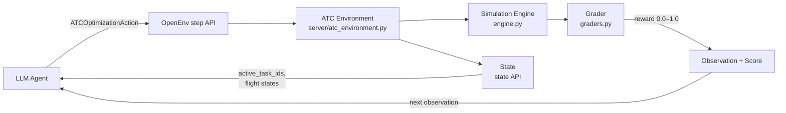
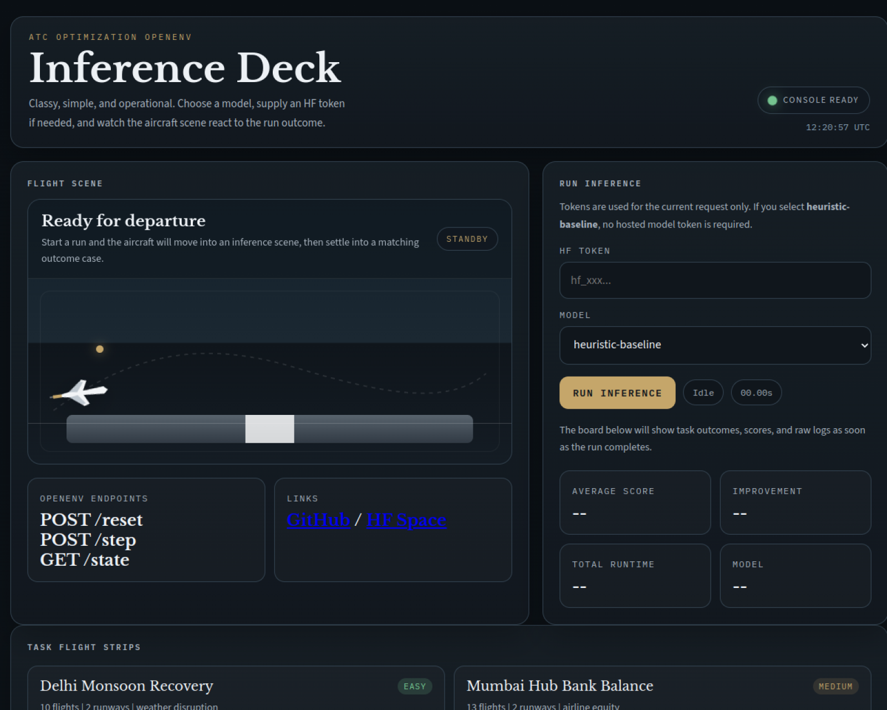

# ATC Optimization OpenEnv

A real-world OpenEnv benchmark for **air traffic disruption recovery**. The agent acts as a tactical ATC/flow controller and must build safe, complete runway slot plans under operational pressure (weather, inspections, emergency priorities, bank balancing).

## Judge Quick View

| Item | Detail |
|------|--------|
| Domain | ATC disruption recovery (real-world, not a game) |
| OpenEnv API | Typed Pydantic models + `/reset` `/step` `/state` |
| Tasks | 4 deterministic graded tasks (easy → medium → hard × 2) |
| Graders | 3-layer gated composite score, strictly bounded 0.0–1.0 |
| Baseline | Root `inference.py`, structured `[START]/[STEP]/[END]` logs |
| Benchmark | See `BENCHMARK.md` — agent vs. random baseline across all 4 tasks |
| Tests | `pytest -q` passes green |
| Infra | Dockerfile + HF Space: https://huggingface.co/spaces/GTsingh12/ATS-openenv |
| Architecture | Mermaid diagram in Environment Design section below |



**Why this is hard for an LLM:** A naive agent that assigns all slots sequentially scores approximately 0.2 on the medium task because it ignores wake turbulence separation minimums between Heavy/Medium/Light aircraft classes. The grader's 3-layer gate requires the agent to satisfy all hard safety constraints before any efficiency or fairness credit is awarded. The agent must simultaneously reason about separation rules, emergency priority overrides (medical/fuel emergencies jump the queue), airline equity across the bank window, and runway capacity — making this a genuine multi-objective planning problem.

## Live Space Preview

Screenshot from the deployed Hugging Face Space:



## Requirement-to-Evidence Matrix

| Requirement | Evidence |
|---|---|
| Real-world utility | `tasks.py` models real ATC disruption scenarios with safety and fairness constraints |
| Full OpenEnv spec | `openenv.yaml`, typed Pydantic models in `models.py`, server endpoints in `server/app.py` |
| 3+ tasks with graders | 4 tasks in `tasks.py`; 3-layer gated composite + auxiliary LLM grading in `graders.py` |
| Meaningful reward shaping | Potential-based dense step-wise reward in `server/atc_environment.py` via `engine.py` simulation |
| Reproducible baseline | Root `inference.py` with deterministic fallback + strict stdout format |
| Docker + Space deployability | `Dockerfile`, `scripts/deploy_hf_space.py`, `scripts/validate-submission.sh` |
| Validation workflow | `python -m openenv.cli validate .`, `python scripts/run_graders.py`, `python inference.py` |

## Environment Design

### Action Space
`ATCOptimizationAction` in `models.py`

- `proposal`: list of `SlotAssignment`
- `rationale`: reasoning summary
- `commit`: finish episode flag

Each `SlotAssignment` includes:

- `flight_id`
- `runway`
- `assigned_minute`
- `hold_minutes`

### Observation Space
`ATCOptimizationObservation` in `models.py`

- task metadata and briefing
- flight and runway state
- current and best metrics
- diagnostics and recommendations
- grader feedback
- `steps_remaining`

### State Space
`ATCOptimizationState` exposed by `/state`

- includes `active_task_ids` so tasks are enumerable by validators/agents

## Tasks and Difficulty

Defined in `tasks.py`:

1. `delhi_monsoon_recovery_easy` — Delhi monsoon departure recovery (easy, 10 flights, 2 runways)
2. `mumbai_bank_balance_medium` — Mumbai hub bank balance (medium, 13 flights, 2 runways)
3. `bengaluru_irrops_hard` — Bengaluru IRROPS recovery command (hard, 17 flights, 2 runways)
4. `hyderabad_cargo_crunch_medium_hard` — Single-runway cargo crunch (hard, 7 flights, 1 runway)

All tasks include all three wake turbulence classes (Heavy, Medium, Light) to exercise asymmetric separation rules. All tasks are scored with deterministic and strictly bounded outputs (`0.0 < score < 1.0`).

## Grading Architecture

Three-layer gated design in `graders.py`:

| Layer | Component | Role |
|---|---|---|
| 1 | `SafetyGateEvaluator` | Hard constraint gates — separation conflicts, incomplete schedule, emergency violations cap score ceiling |
| 2 | `PriorityRubricGrader` | Grades emergency/medical/connection prioritization quality (50% emergency + 30% medical + 20% connection) |
| 3 | `EfficiencyRubricGrader` | Grades delay (35%), fuel (25%), fairness (20%), connection impact (20%) |
| Final | `GatedCompositeGrader` | Official score = `min(gate_ceiling, 0.30 × priority + 0.70 × efficiency)` clamped to strict `(0, 1)` |

Auxiliary `LLMSupervisorGrader` runs independently as a side-channel and does NOT contribute to the official composite score.

## Reward and Scoring

Operational score components in `engine.py`:

- completeness (24%)
- conflict-free ratio (24%)
- priority handling (18%)
- delay efficiency (16%)
- fairness (10%)
- fuel efficiency (8%)

Reward behavior:

- first valid submission receives full score as reward
- subsequent steps receive potential-based incremental reward (current − previous)
- invalid/incomplete/conflicting plans are penalized via safety gates

Official submission score is the deterministic gated composite grading from `graders.py`.

## Wake Turbulence Separation Matrix

| Leader → Follower | Heavy | Medium | Light |
|---|---|---|---|
| **Heavy** | 4 min | 5 min | 6 min |
| **Medium** | 3 min | 3 min | 4 min |
| **Light** | 3 min | 3 min | 3 min |

Defined in `constants.py` and used by both `engine.py` and `planner.py`.

## Baseline Inference (Submission Script)

Root file: `inference.py`

- uses OpenAI client interface
- reads `API_BASE_URL`, `MODEL_NAME`, `HF_TOKEN`
- emits strict structured logs:
  - `[START] task=<id> env=atc_optimization_openenv model=<model>`
  - `[STEP] step=<n> action=<action> reward=<0.00> done=<true|false> error=<msg|null>`
  - `[END] task=<id> success=<true|false> steps=<n> score=<0.00> rewards=<r1,r2,...>`
- deterministic fallback when model output is unavailable/invalid
- all scores strictly within `(0, 1)` — never exactly 0.0 or 1.0

### Tasks Run by Inference

The baseline inference script runs the following 3 tasks:

- `delhi_monsoon_recovery_easy`
- `mumbai_bank_balance_medium`
- `bengaluru_irrops_hard`

The 4th task (`hyderabad_cargo_crunch_medium_hard`) is available via the environment API but not included in the baseline inference to stay within the 20-minute runtime limit.

## Repository Layout

| File | Purpose |
|---|---|
| `models.py` | Typed Pydantic contracts (Action, Observation, State, domain models) |
| `tasks.py` | Scenario catalog — 4 task definitions with flights, runways, budgets |
| `engine.py` | Deterministic simulation + metric computation + reward shaping |
| `graders.py` | 3-layer gated graders + auxiliary LLM grader |
| `planner.py` | Deterministic heuristic + refinement baseline planner |
| `constants.py` | Centralized constants (wake separation, weights, precision, thresholds) |
| `client.py` | OpenEnv client wrapper for agent-side usage |
| `imports.py` | Import utilities for relative/absolute compatibility |
| `server/app.py` | FastAPI/OpenEnv entrypoint via `create_app()` |
| `server/atc_environment.py` | `Environment` implementation — reset, step, state |
| `inference.py` | Required baseline submission script (root) |
| `openenv.yaml` | OpenEnv environment metadata |
| `BENCHMARK.md` | Judge-facing benchmark summary with task-by-task comparison table |
| `results/benchmark_scores.json` | Placeholder runtime/score artifact to fill after running `python inference.py` |
| `Dockerfile` | Container runtime for HF Space deployment |
| `pyproject.toml` | Python project config and dependencies |
| `scripts/run_graders.py` | Task grading check with strict `(0, 1)` assertions |
| `scripts/ping_env.py` | Deployment health/reset ping |
| `scripts/validate-submission.sh` | Judge-style full validator |
| `scripts/pre_submission_validate.sh` | Convenience pre-submission wrapper |
| `scripts/deploy_hf_space.py` | HF API deployment helper |
| `tests/` | pytest suite (grader contracts, env integration, inference, constants) |

## Setup

```bash
pip install uv
uv sync
```

## Required Environment Variables

```bash
export API_BASE_URL="https://router.huggingface.co/v1"
export MODEL_NAME="Qwen/Qwen2.5-72B-Instruct"
export HF_TOKEN="your-secret-token"
```

Note: use `python inference.py` (script) or `python -m inference` (module), not `python -m inference.py`.

## Local Runbook

Start server:

```bash
uvicorn server.app:app --host 0.0.0.0 --port 8000
```

Run OpenEnv validation:

```bash
python -m openenv.cli validate .
```

Run all graders:

```bash
python scripts/run_graders.py
```

Run baseline inference:

```bash
python inference.py
```

Run tests:

```bash
uv run pytest -q
```

## Docker

Build:

```bash
docker build -t atc-openenv .
```

Run:

```bash
docker run --rm -p 8000:8000 atc-openenv
```

## Hugging Face Space Deployment

### Option A: Manual

1. Create HF Space with SDK = Docker
2. Push repository
3. Set secrets: `API_BASE_URL`, `MODEL_NAME`, `HF_TOKEN`
4. Ping deployment:

```bash
python scripts/ping_env.py https://<your-space>.hf.space
```

### Option B: HF API Helper

Token-only template is provided in `.env.hf_space.example`.

```bash
export HF_TOKEN="hf_xxx"
export HF_SPACE_ID="<owner>/<space-name>"
python scripts/deploy_hf_space.py --space-id "$HF_SPACE_ID" --repo-dir .
```

Then validate:

```bash
./scripts/validate-submission.sh "https://<owner>-<space-name>.hf.space" .
```

## Pre-Submission Checklist

Run all before final submission:

```bash
python -m openenv.cli validate .
uv run pytest -q
python scripts/run_graders.py
python inference.py
./scripts/validate-submission.sh https://<your-space>.hf.space .
```

Expected:

- OpenEnv validate: `[OK] : Ready for multi-mode deployment`
- All grader scores strictly bounded `(0.0, 1.0)` — never exactly 0 or 1
- Inference logs strictly follow `[START]/[STEP]/[END]` format
- Space responds to `/health` and `/reset`

## Notes for Judges

- **Deterministic scoring** is intentional for reproducibility and anti-gaming
- **3-layer gated architecture**: safety gates enforce hard ceilings (conflicts → max 0.40, missing → max 0.50, emergency violation → max 0.35) that cannot be compensated by good efficiency
- **Strict `(0, 1)` bounds**: `_strict_score()` with ε=1e-4 guarantees no boundary values reach exactly 0.0 or 1.0
- **Optional LLM signals** are preserved as auxiliary analysis, not official score drivers
- **4 tasks with 3 wake classes**: all tasks include Heavy, Medium, and Light aircraft exercising the full asymmetric wake turbulence separation matrix
- **Potential-based reward shaping** (Ng et al. 1999) ensures policy-gradient-safe dense rewards
