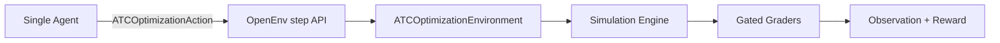
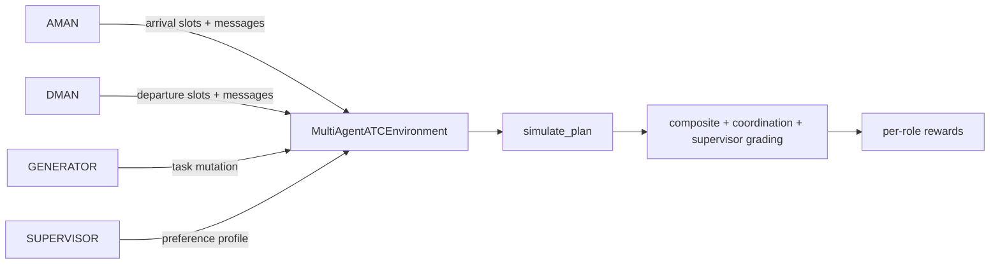

# Shared Runways, Split Intelligence

*Multi-agent reinforcement learning for cooperative air traffic control under adversarial curriculum pressure*

---

At any major airport, hundreds of aircraft compete for a handful of runways every hour. The arrival manager doesn't know the departure queue. The departure manager doesn't know the landing sequence. Emergencies arrive unannounced. And the definition of "a good plan" shifts every session.

We built this coordination problem as a live RL environment — and trained two agents to solve it together.

---

## What Makes This Hard

- **Asymmetric information**: The arrival agent (AMAN) sees inbound flights only. The departure agent (DMAN) sees outbound flights only. Neither has the full picture. They coordinate through messages alone.
- **Shared contested resource**: Both agents assign slots to the same physical runways. Conflicts are penalized. Emergencies must be cleared regardless of the cost to the schedule.
- **Adversarial pressure**: A third agent (GENERATOR) continuously mutates scenarios to stay at the controllers' skill frontier — using PAIRED regret maximization so tasks are never too easy or unsolvable.
- **Shifting objectives**: A fourth agent (SUPERVISOR) rotates preference profiles each episode. What scored "excellent" last round may score poorly this one. Agents cannot overfit to a single metric.
- **Real physics**: Asymmetric wake turbulence separation (Heavy/Medium/Light), ATFM network slot deadlines, emergency priority overrides. Not a toy grid.

---

## Judge Quick View

| Item | Detail |
|---|---|
| Domain | Real ATC disruption recovery across four Indian airports |
| Modes | Single-agent OpenEnv + multi-agent AMAN/DMAN coordination |
| Tasks | 4 deterministic tasks spanning easy to hard |
| Grading | 3-layer gated composite score, strict `(0, 1)` output |
| Multi-agent extras | PAIRED generator curriculum, rotating supervisor profiles, coordination grading |
| Training stack | GRPO · COMA-style counterfactual credit · per-scenario mastery tracking |
| Baselines | `inference.py` (single-agent) · `multi_agent/inference.py` (multi-agent) |
| Validation | `pytest -q` · `scripts/run_graders.py` · OpenEnv validation |
| Space | https://huggingface.co/spaces/GTsingh12/ATS-openenv |

---

## Results

### Heuristic Baseline

| Task | Difficulty | Random | Heuristic Agent | Δ |
|---|---|---|---|---|
| Delhi Monsoon Recovery | Easy | 0.21 | **0.9446** | +0.73 |
| Mumbai Hub Bank Balance | Medium | 0.18 | **0.9900** | +0.81 |
| Bengaluru IRROPS | Hard | 0.12 | **0.8615** | +0.74 |
| Hyderabad Cargo Crunch | Hard | 0.15 | **0.8576** | +0.71 |
| **Average** | | **0.165** | **0.9134** | **+0.748** |

Random agents score below 0.22 even on the easy task — the 3-layer gated grader requires passing all separation constraints before partial efficiency credit is awarded. A random guess almost never clears the safety gate.

### Trained Model

*GRPO training in progress. Results and reward curves will be added here once the training run completes.*

---

## Training Stack

One base model, four roles via system prompts. GRPO over a live multi-agent episode rollout.

```
GRPO
├── Group-relative advantage: A_i = (r_i − mean(group)) / (std(group) + ε)
├── COMA-style counterfactual credit per role
│     cf_advantage = agent_outcome − naive_baseline_outcome (clamped to [-1, 1])
├── PAIRED curriculum (generator reward = -(controller_score − heuristic_baseline))
│     → generator is rewarded for staying at the agents' skill frontier
├── Per-scenario mastery tracking (rolling deque per task × mutation type)
│     → weak mutation types are boosted 3× in sampling pool
└── Rotating supervisor profiles (5 profiles, deterministic rotation)
      → prevents reward hacking against a fixed metric
```

---

## Architecture

### Single-Agent



### Multi-Agent



*AMAN and DMAN cannot read each other's observations. Information crosses the boundary only through the message channel.*

---

## Tasks

| Task ID | Airport | Difficulty | Flights | Runways | Scenario |
|---|---|---|---:|---:|---|
| `delhi_monsoon_recovery_easy` | Delhi IGI | Easy | 10 | 2 | Monsoon disruption, VVIP slot constraint, wake-spacing edge cases |
| `mumbai_bank_balance_medium` | Mumbai CSIA | Medium | 14 | 2 | Mixed passenger/cargo bank balancing under disruption |
| `bengaluru_irrops_hard` | Bengaluru KIA | Hard | 18 | 2 | Emergency arrival, medical departure, ATFM deadlines, dual-runway IRROPS |
| `hyderabad_cargo_crunch_medium_hard` | Hyderabad RGIA | Hard | 7 | 1 | Single-runway wake asymmetry puzzle, cargo priority |

All tasks include Heavy, Medium, and Light wake classes exercising the full asymmetric separation matrix.

---

## Scoring

### Single-Agent Official Score

Three-layer gated design in `graders.py`:

1. `SafetyGateEvaluator` — separation violations cap the ceiling
2. `PriorityRubricGrader` — emergency and priority handling
3. `EfficiencyRubricGrader` — delay minimization and throughput

```
score = min(gate_ceiling, 0.30 × priority_score + 0.70 × efficiency_score)
```

Always clamped to the strict open interval `(0, 1)`.

### Multi-Agent Outputs

`grade_multi_agent(...)` returns three graders:

- `composite_task_grader` (weight 0.45)
- `multi_agent_coordination` (weight 0.40)
- `llm_supervisor` (weight 0.15)

Per-role signals from the environment:

- `aman_reward` · `dman_reward` · `generator_reward` · `supervisor_score`
- Coordination score, cross-lane conflict count, emergency handling flags

---

## Reward Design

### Single-Agent

Potential-based shaping in `server/atc_environment.py`:

```
reward = current_score − previous_score
```

Dense feedback at every step without changing the optimal policy target.

### Multi-Agent

Role-specific rewards in `training/reward_functions.py`:

| Component | AMAN weight | DMAN weight |
|---|---|---|
| Delay penalty | 0.26 | 0.23 |
| Emergency handling | 0.20 | 0.16 |
| Coverage | 0.17 | 0.12 |
| Coordination quality | 0.13 | 0.13 |
| Conflict penalty | 0.12 | 0.19 |
| Counterfactual advantage (COMA) | 0.12 | 0.12 |
| ATFM compliance | — | 0.05 |

Generator reward: `-(controller_score − heuristic_baseline_on_mutated_task)` — maximizes regret to keep tasks at the skill frontier.

---

## Wake Turbulence Separation Matrix

From `constants.py`:

| Leader → Follower | Heavy | Medium | Light |
|---|---:|---:|---:|
| Heavy | 4 min | 5 min | 6 min |
| Medium | 3 min | 3 min | 4 min |
| Light | 3 min | 3 min | 3 min |

---

## Repository Layout

| Path | Purpose |
|---|---|
| `models.py` | Single-agent contracts and domain models |
| `tasks.py` | Scenario catalog and task briefing generation |
| `engine.py` | Deterministic simulation and metric computation |
| `graders.py` | Composite, coordination, and supervisor graders |
| `planner.py` | Deterministic heuristic and refinement planner |
| `constants.py` | Shared scoring, separation, and multi-agent constants |
| `client.py` | OpenEnv client wrapper |
| `inference.py` | Single-agent baseline runner |
| `multi_agent/models.py` | AMAN/DMAN/generator/supervisor contracts |
| `multi_agent/environment.py` | Multi-agent environment and per-role rewards |
| `multi_agent/generator.py` | PAIRED adversarial curriculum with mastery tracking |
| `multi_agent/supervisor.py` | Rotating supervisor preference profiles |
| `multi_agent/inference.py` | Multi-agent heuristic/LLM episode runner |
| `training/dataset.py` | GRPO dataset builder and output parsers |
| `training/reward_functions.py` | Role-specific GRPO reward functions with COMA credit |
| `training/train_grpo.py` | Multi-agent GRPO training entry point |
| `training/eval.py` | Before/after training evaluation |
| `server/app.py` | FastAPI/OpenEnv app + UI + multi-agent endpoints |
| `server/atc_environment.py` | Single-agent OpenEnv environment |
| `openenv.yaml` | OpenEnv metadata including multi-agent declarations |
| `BENCHMARK.md` | Single-agent benchmark results |
| `scripts/run_graders.py` | Deterministic grader smoke check |
| `tests/` | 46 automated tests across single-agent and multi-agent paths |

---

## Setup

```bash
pip install uv
uv sync --extra dev
```

Training extras (GPU required):

```bash
uv sync --extra dev --extra training
```

---

## Environment Variables

```bash
export API_BASE_URL="https://router.huggingface.co/v1"
export MODEL_NAME="Qwen/Qwen2.5-72B-Instruct"
export HF_TOKEN="your-secret-token"
```

---

## Running the Environment

### Start the Server

```bash
python -m uvicorn server.app:app --host 0.0.0.0 --port 8000
```

### Validate

```bash
python -m openenv.cli validate .
python -m pytest -q
python scripts/run_graders.py
```

### Single-Agent Baseline

```bash
python inference.py
```

### Multi-Agent Heuristic Baseline

```bash
python multi_agent/inference.py --all_tasks --episodes 1
```

With an LLM:

```bash
python multi_agent/inference.py --model "$MODEL_NAME" --all_tasks --episodes 1
```

### Train

```bash
python training/train_grpo.py --episodes 200 --output_dir ./outputs/atc-multiagent
```

### Evaluate a Trained Checkpoint

```bash
python training/eval.py --base heuristic-baseline --trained ./outputs/atc-multiagent --episodes 10
```

---

## Multi-Agent HTTP Endpoints

Exposed by the FastAPI app alongside the standard OpenEnv routes:

| Endpoint | Method | Description |
|---|---|---|
| `/multi_agent/reset` | POST | Start a new multi-agent episode |
| `/multi_agent/step/bid` | POST | Submit AMAN and DMAN bid actions |
| `/multi_agent/finalize` | POST | Close the episode and retrieve rewards |
| `/multi_agent/episode` | POST | Run a full episode in one call |
| `/multi_agent/profiles` | GET | List available supervisor profiles |
| `/multi_agent/status` | GET | Environment state and current round |

---

## Docker

```bash
docker build -t atc-openenv .
docker run --rm -p 8000:8000 atc-openenv
```

---

## HuggingFace Space Deployment

### Option A: Manual

1. Create a Space with SDK = Docker
2. Push this repository
3. Set secrets: `API_BASE_URL`, `MODEL_NAME`, `HF_TOKEN`

### Option B: Helper Script

```bash
export HF_TOKEN="hf_xxx"
export HF_SPACE_ID="<owner>/<space-name>"
python scripts/deploy_hf_space.py --space-id "$HF_SPACE_ID" --repo-dir .
```

---

## Validation Status

The current repository validates cleanly on the local surface:

- `python -m pytest -q` — 46 tests passing
- `python scripts/run_graders.py`
- `python inference.py`
- `python multi_agent/inference.py --all_tasks --episodes 1`

---

## Design Decisions

- **Deterministic scoring** — reproducible grading prevents gaming; every score can be re-derived from the task definition alone.
- **Safety gate is absolute** — separation violations cap the score and cannot be compensated away by efficiency. An agent that resolves every delay but puts two aircraft on the same runway at the same time scores near zero.
- **GRPO over PPO** — no value network required. Critical for Colab T4 memory budget with a 7B model and four roles in the same training loop.
- **Single model, multiple roles** — AMAN and DMAN are system-prompt-differentiated instances of the same weights. This is intentional: it tests whether one model can reason from asymmetric information frames, not whether two separate models can each be individually tuned.
- **Partial observability is structural** — AMAN receives `atfm_deadlines={}`. DMAN receives the real deadline map. Neither can cheat. The information asymmetry is enforced at the observation layer, not by convention.
